# ShelfLife — Felhasználói Útmutató / User Guide

> **Magyar / English** — kétnyelvű útmutató | bilingual guide

---

## Tartalomjegyzék / Table of Contents

1. [Bejelentkezés & Regisztráció / Login & Sign Up](#1-bejelentkezés--regisztráció--login--sign-up)
2. [Főoldal / Home](#2-főoldal--home)
3. [Tárolók / Storages](#3-tárolók--storages)
4. [Tároló részletei / Storage Detail](#4-tároló-részletei--storage-detail)
5. [Termékek / Products](#5-termékek--products)
6. [Bevásárlólista / Shopping List](#6-bevásárlólista--shopping-list)
7. [Értesítések / Notifications](#7-értesítések--notifications)
8. [Profil / Profile](#8-profil--profile)

---

## 1. Bejelentkezés & Regisztráció / Login & Sign Up

### Magyar

Ez az első képernyő, ami megjelenik az alkalmazás megnyitásakor.

**Bejelentkezés (Login)**
- Add meg az e-mail címed és a jelszavadat.
- Nyomd meg a **Login** gombot a belépéshez.

**Regisztráció (Sign Up)**
- Koppints a **Sign Up** fülre a képernyő tetején.
- Töltsd ki a következő mezőket:
  - **Username** — felhasználónév (ez jelenik meg mások számára)
  - **Email** — e-mail cím
  - **Password** — jelszó
  - **Confirm Password** — jelszó megerősítése
- Nyomd meg a **Sign Up** gombot a fiók létrehozásához.

> Ha valami nem stimmel (pl. a két jelszó nem egyezik), az alkalmazás hibát jelez a gomb felett.

---

### English

This is the first screen that appears when you open the app.

**Login**
- Enter your email address and password.
- Tap **Login** to sign in.

**Sign Up**
- Tap the **Sign Up** tab at the top of the screen.
- Fill in the following fields:
  - **Username** — your display name (visible to others)
  - **Email** — your email address
  - **Password** — choose a password
  - **Confirm Password** — repeat your password
- Tap **Sign Up** to create your account.

> If something is wrong (e.g. passwords don't match), the app shows an error message above the button.

---

### Képernyőképek / Screenshots

| Login | Sign Up |
|-------|---------|
| 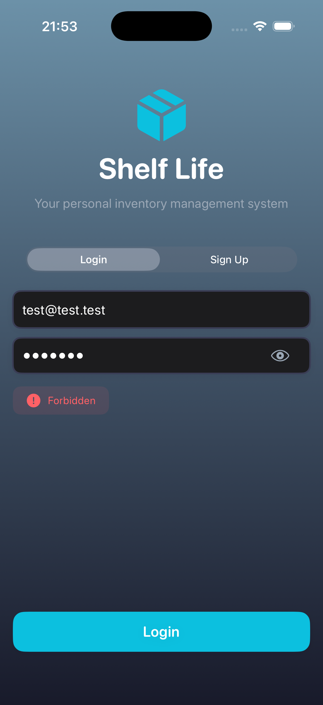 | 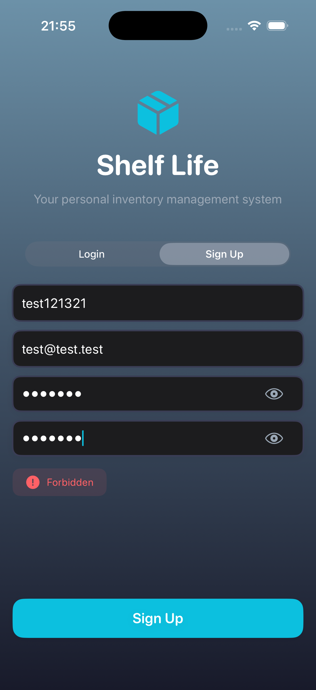 |

---

## 2. Főoldal / Home

### Magyar

A főoldal egy gyors áttekintést ad az otthoni készletedről.

**Statisztikai kártyák**

Három kártya látható egymás alatt:
- **Total Storages** — hány tárolóhelyed van (pl. hűtő, kamra). Koppintásra megnyitja a Tárolók oldalt.
- **Products** — az összes terméked száma. Koppintásra megnyitja a Termékek oldalt.
- **Shopping List** — hány tétel van a bevásárló listádon. Koppintásra megnyitja a Bevásárlólistát.

**Frissítés**
- Az oldalt le lehet húzni (pull-to-refresh) az adatok frissítéséhez.

---

### English

The home screen gives you a quick overview of your household inventory.

**Stat Cards**

Three cards are shown one below the other:
- **Total Storages** — how many storage locations you have (e.g. fridge, pantry). Tap to open the Storages page.
- **Products** — the total number of products. Tap to open the Products page.
- **Shopping List** — how many items are on your shopping list. Tap to open the Shopping List.

**Refresh**
- Pull down on the page to refresh all data.

---

### Képernyőképek / Screenshots

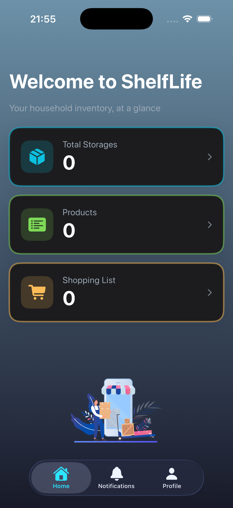

---

## 3. Tárolók / Storages

### Magyar

Ezen az oldalon kezelheted a tárolóhelyeidet (pl. hűtő, kamra, fagyasztó).

**Tárolók listája**

A tárolók két csoportba vannak rendezve:
- **My Storages (Saját tárolók)** — amelyeket te hoztál létre (korona ikonnal jelölve).
- **Shared with Me (Megosztott velem)** — amelyekbe mások hívtak meg.

**Keresés**
- Az oldal tetején lévő keresőmezőbe írj be a szűréshez. A keresés automatikusan, gépelés közben működik.

**Új tároló létrehozása**
- Koppints a jobb felső sarokban lévő **+** gombra.
- Add meg a tároló nevét, majd mentsd el.

**Szerkesztés és törlés**
- Húzz balra egy tárolón a swipe-menü megjelenítéséhez:
  - **Edit (Szerkesztés)** — névváltoztatás (csak saját tárolókon)
  - **Delete (Törlés)** — tároló törlése (csak saját tárolókon)
  - **Leave (Kilépés)** — kilépés egy megosztott tárolóból

**Lapozási beállítások (Pagination)**
- A keresőmező mellett lévő fogaskerék ikonra koppintva beállíthatod, hogy egyszerre hány tároló jelenjen meg (5, 10, 15, 20 vagy mind), és lapozhatsz az oldalak között.

**Frissítés**
- Húzd le az oldalt a lista frissítéséhez.

---

### English

This page lets you manage your storage locations (e.g. fridge, pantry, freezer).

**Storage List**

Storages are grouped into two sections:
- **My Storages** — ones you created (marked with a crown icon).
- **Shared with Me** — ones where others invited you.

**Search**
- Type in the search bar at the top to filter the list. The search works automatically as you type.

**Creating a New Storage**
- Tap the **+** button in the top-right corner.
- Enter the storage name and save.

**Editing and Deleting**
- Swipe left on a storage to reveal the action menu:
  - **Edit** — rename the storage (your own storages only)
  - **Delete** — delete the storage (your own storages only)
  - **Leave** — leave a storage that was shared with you

**Pagination Settings**
- Tap the gear icon next to the search bar to set how many storages are shown per page (5, 10, 15, 20 or all), and to navigate between pages.

**Refresh**
- Pull down the list to refresh.

---

### Képernyőképek / Screenshots

| Tárolók listája | Keresés | Swipe műveletek | Új tároló |
|-----------------|---------|-----------------|-----------|
| 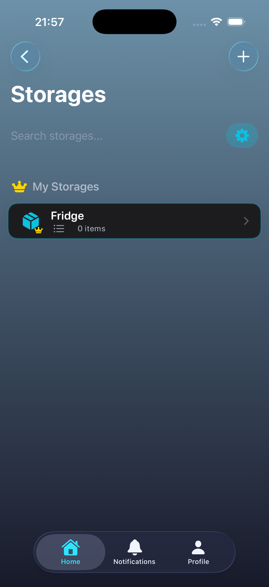 | 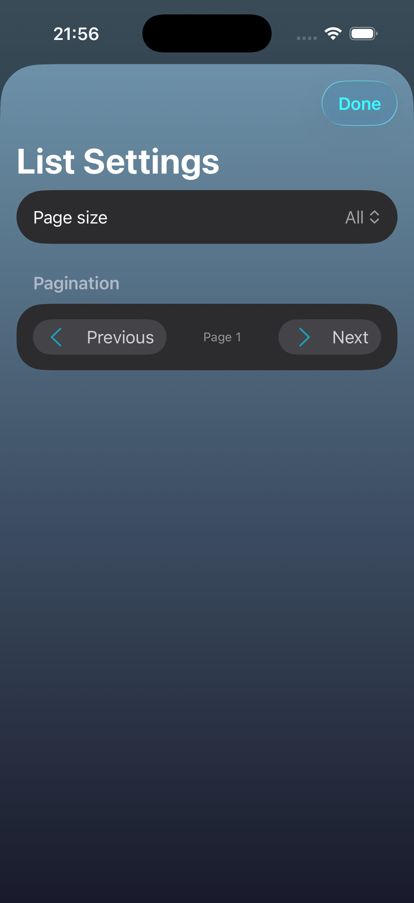 | 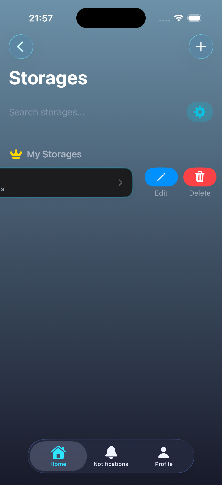 | 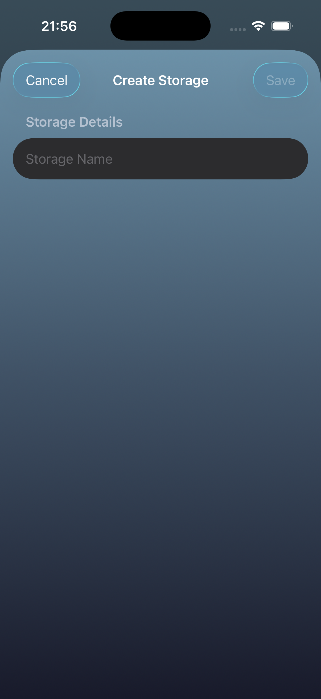 |

---

## 4. Tároló részletei / Storage Detail

### Magyar

Egy tárolóra koppintva megnyílik a részletes nézet, ahol az adott tárolóban lévő tételeket kezelheted.

**Fejléc kártya**
- A képernyő tetején látható a tároló neve és a tulajdonos neve.

**Tételek (Items)**
- A tárolóban lévő összes termék listája látható mennyiséggel és lejárati dátummal együtt.
- Swipe balra egy tételen a következő műveletek eléréséhez:
  - **Delete (Törlés)** — tétel törlése a tárolóból
  - **Add to List / In List (Hozzáadás listához)** — tétel hozzáadása a bevásárló listához (ha már rajta van, szürke „In List" gomb jelenik meg)
  - **Set Alert / Running Low (Riasztás beállítása)** — értesítés beállítása, ha a készlet egy adott szint alá csökken

**Tagok (Members)**
- A tároló tagjait egy külön szakaszban láthatod.
- A tulajdonos a tagok listájában is fel van tüntetve.

**Meghívott tagok (Invited)**
- A még el nem fogadott meghívásokat itt láthatod (csak a tároló tulajdonosaként).
- Koppints a **X** gombra egy meghívás visszavonásához.

**Menü gomb (jobb felső sarok)**
Koppints a **+ körbe** a menü megnyitásához:
- **Add Item** — új tétel hozzáadása a tárolóhoz (termék kiválasztásával)
- **Invite Member** — tag meghívása e-mail cím alapján (csak tulajdonosként)
- **Edit Storage** — tároló átnevezése (csak tulajdonosként)

**Frissítés**
- Húzd le az oldalt a tagok és tételek frissítéséhez.

---

### English

Tapping on a storage opens the detail view, where you can manage the items inside that storage.

**Header Card**
- The top card shows the storage name and the owner's username.

**Items**
- All products in the storage are listed with their quantities and expiration dates.
- Swipe left on an item to reveal actions:
  - **Delete** — remove the item from the storage
  - **Add to List / In List** — add the item to your shopping list (if already added, a grey "In List" button appears)
  - **Set Alert / Running Low** — set a low-stock alert threshold for the item

**Members**
- The members of this storage are shown in a separate section.
- The owner also appears in the member list.

**Invited (Pending Invitations)**
- Pending invitations that haven't been accepted yet are shown here (owner only).
- Tap **X** to cancel a pending invitation.

**Menu Button (top-right corner)**
Tap the **+ circle** to open the menu:
- **Add Item** — add a new item to this storage by selecting a product
- **Invite Member** — invite someone by email address (owner only)
- **Edit Storage** — rename the storage (owner only)

**Refresh**
- Pull down to refresh members and items.

---

### Képernyőképek / Screenshots

| Tároló részletei | Menü | Tétel hozzáadása |
|------------------|------|------------------|
| 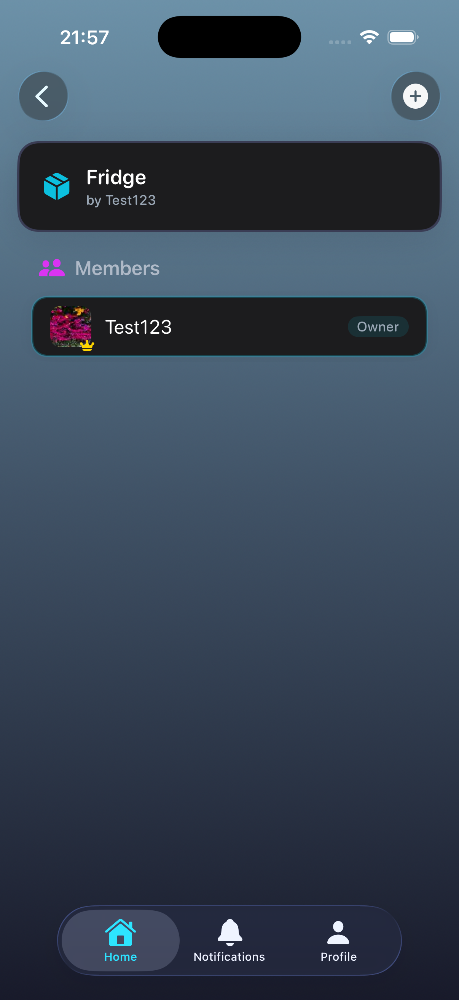 | 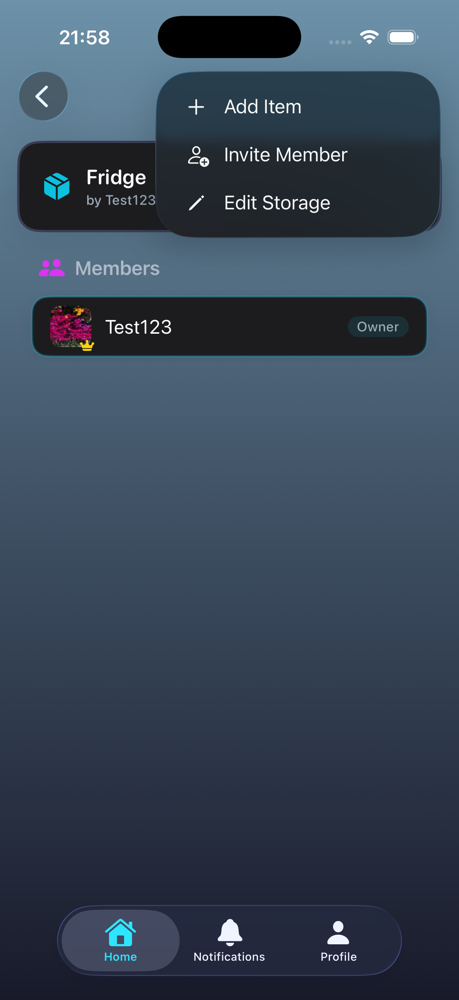 | 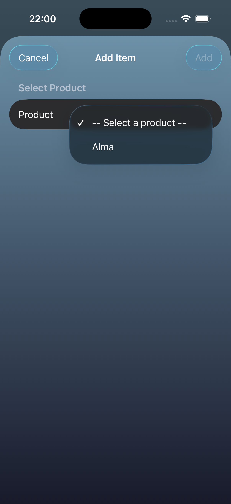 |

| Tétel swipe műveletek | Riasztás beállítása | Tag meghívása | Függő meghívás |
|-----------------------|---------------------|---------------|----------------|
| 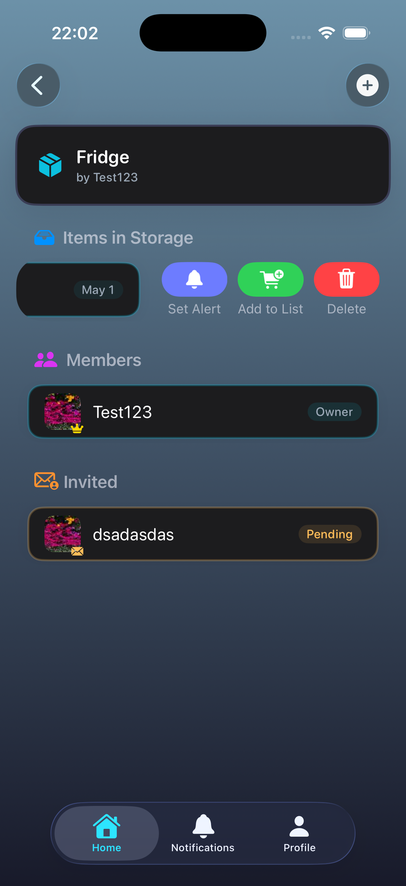 | 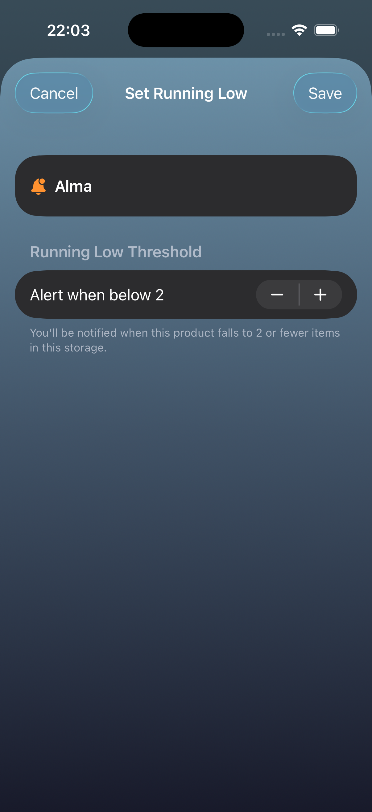 | 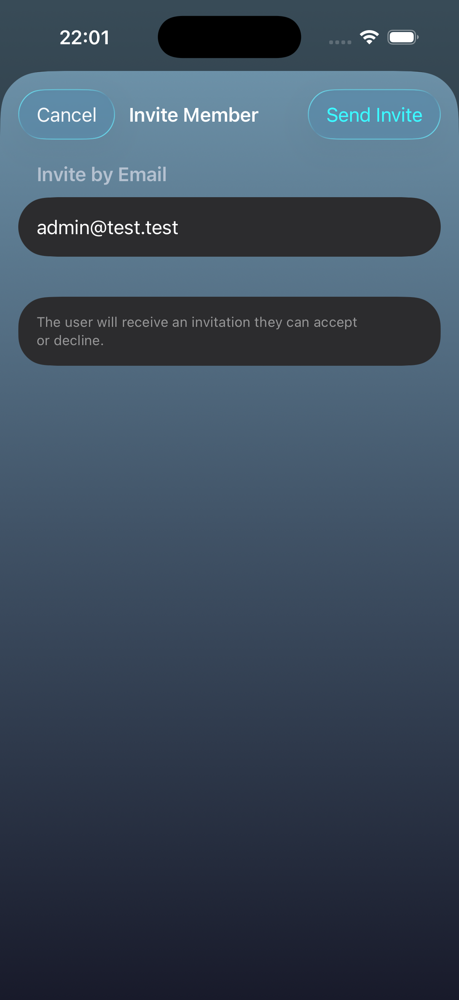 | 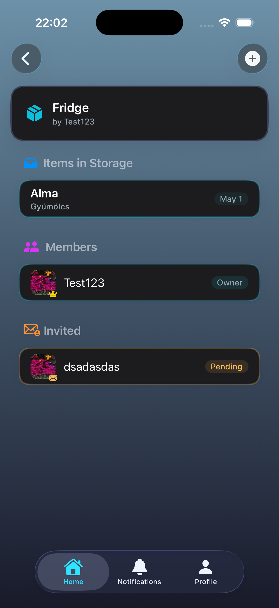 |

---

## 5. Termékek / Products

### Magyar

Ezen az oldalon kezelheted az alkalmazásban szereplő termékeket.

**Termékek listája**

A termékek két csoportba vannak rendezve:
- **Own Products (Saját termékek)** — azok, amelyeket te hoztál létre.
- **Global Products (Globális termékek)** — az összes többi felhasználó által létrehozott termék (csak olvasható).

**Keresés**
- Az oldal tetején lévő keresőmezőbe írj be termékre való kereséshez. A keresés automatikusan, gépelés közben működik.

**Új termék létrehozása**
- Koppints a jobb felső sarokban lévő **+** gombra.
- Töltsd ki a következő adatokat:
  - **Név** — a termék neve
  - **Kategória** — pl. tejtermék, gyümölcs, pékáru
  - **Lejárati napok száma** — hány nap után jár le a termék általában
  - **Vonalkód** — opcionális, vonalkódos azonosításhoz

**Szerkesztés és törlés (saját termékeken)**
- Húzz balra egy terméken a swipe-menü megjelenítéséhez:
  - **Edit (Szerkesztés)** — termék adatainak módosítása
  - **Delete (Törlés)** — termék törlése

**Szűrés kategória és lapozás szerint**
- A keresőmező melletti fogaskerék ikonra koppintva:
  - Szűrhetsz kategória szerint
  - Beállíthatod az oldalanként megjelenő termékek számát (5, 10, 15, 20 vagy mind)
  - Lapozhatsz az oldalak között

**Frissítés**
- Húzd le az oldalt a lista frissítéséhez.

---

### English

This page lets you manage the products in the app.

**Product List**

Products are grouped into two sections:
- **Own Products** — products you created.
- **Global Products** — products created by other users (read-only for you).

**Search**
- Type in the search bar at the top to filter products. The search works automatically as you type.

**Creating a New Product**
- Tap the **+** button in the top-right corner.
- Fill in the following fields:
  - **Name** — the product's name
  - **Category** — e.g. dairy, fruit, bakery
  - **Expiration Days** — how many days until the product typically expires
  - **Barcode** — optional, for barcode-based identification

**Editing and Deleting (your own products)**
- Swipe left on a product to reveal actions:
  - **Edit** — modify the product's details
  - **Delete** — delete the product

**Filter by Category and Pagination**
- Tap the gear icon next to the search bar to:
  - Filter by category
  - Set how many products are shown per page (5, 10, 15, 20 or all)
  - Navigate between pages

**Refresh**
- Pull down the list to refresh.

---

### Képernyőképek / Screenshots

| Termékek listája | Swipe műveletek | Új termék létrehozása |
|------------------|-----------------|-----------------------|
| 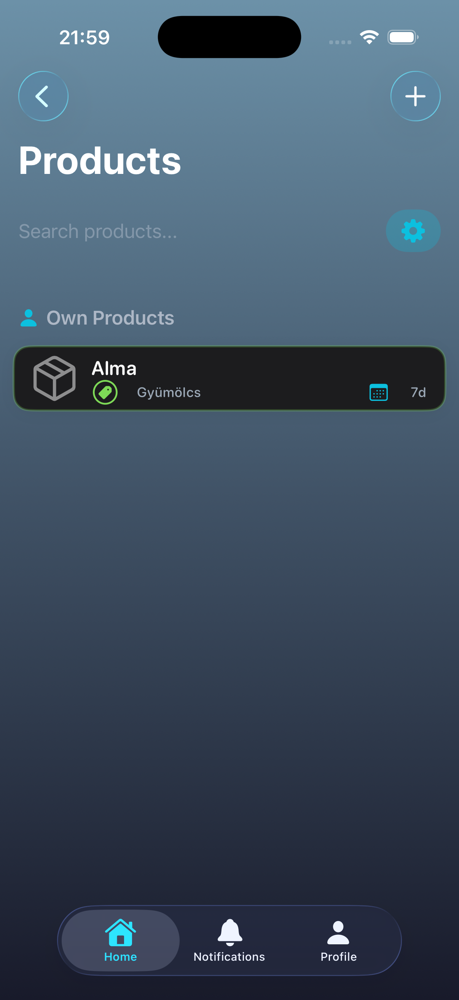 | 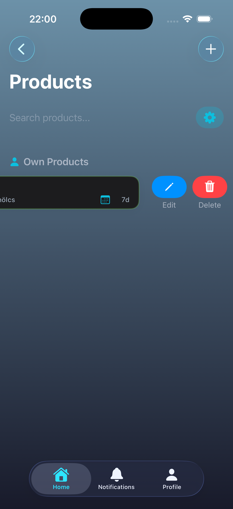 | 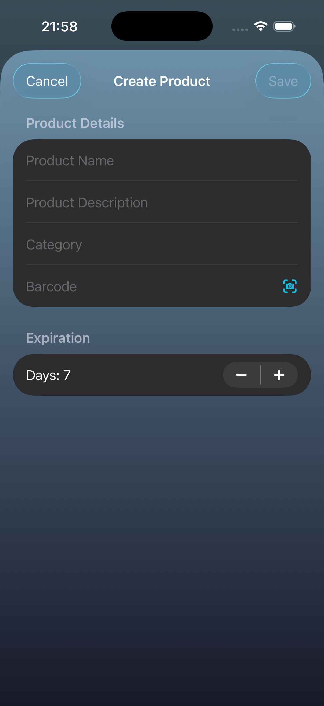 |

---

## 6. Bevásárlólista / Shopping List

### Magyar

Ezen az oldalon nyomon követheted, mit kell venned a boltban.

**A lista tartalma**

Minden listatételnél látható:
- A termék neve és képe
- Mennyiség (hányat kell belőle venni)
- Melyik tárolóba szántad (pl. „Hűtő")

**Mennyiség módosítása**
- Minden tételnél **+** és **−** gombokkal tudod növelni vagy csökkenteni a szükséges mennyiséget.

**Tétel elvégzése vagy törlése**
- Húzz balra egy tételen a swipe-menü megjelenítéséhez:
  - **Done (Elvégzve)** — tétel megvásárlásának jelzése és törlése a listáról
  - **Delete (Törlés)** — tétel törlése vásárlás nélkül

**Új tétel hozzáadása**
- Koppints a jobb felső sarokban lévő **+** gombra.
- Válaszd ki:
  - Melyik tárolóhoz szánod
  - Melyik terméket szeretnéd venni
  - Hány darabot kell belőle venni (1–99)
- Koppints az **Add** gombra a hozzáadáshoz.

> Tételeket a Tároló részletei oldalról vagy az Értesítések oldalról is adhatsz hozzá a listához.

**Frissítés**
- Húzd le az oldalt a lista frissítéséhez.

---

### English

This page lets you track what you need to buy at the store.

**List Contents**

Each item shows:
- The product's name and image
- Quantity (how many to buy)
- Which storage it's intended for (e.g. "Fridge")

**Adjusting Quantity**
- Use the **+** and **−** buttons on each item to increase or decrease the quantity.

**Completing or Deleting an Item**
- Swipe left on an item to reveal actions:
  - **Done** — mark the item as purchased and remove it from the list
  - **Delete** — remove the item without marking it as bought

**Adding a New Item**
- Tap the **+** button in the top-right corner.
- Select:
  - Which storage it's for
  - Which product you want to buy
  - How many you need (1–99)
- Tap **Add** to add it to the list.

> You can also add items to the shopping list from the Storage Detail page or the Notifications page.

**Refresh**
- Pull down to refresh the list.

---

### Képernyőképek / Screenshots

| Bevásárlólista | Swipe műveletek |
|----------------|-----------------|
| 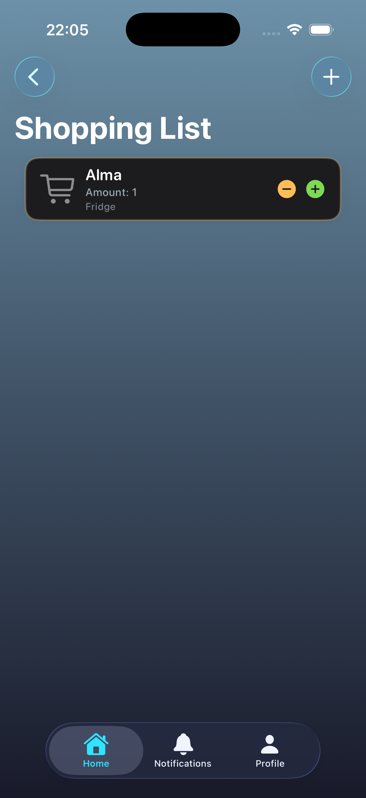 | 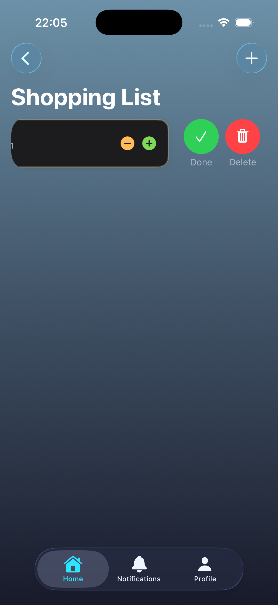 |

---

## 7. Értesítések / Notifications

### Magyar

Az értesítések oldala három típusú figyelmeztetést jeleníthet meg.

**1. Hamarosan lejáró / lejárt termékek (Expiring & Expired Items)**
- Azok a termékek jelennek meg itt, amelyek közel vannak a lejárati dátumhoz, vagy már le is jártak.
- Minden tétel mutatja:
  - A termék nevét és képét
  - Melyik tárolóban van
  - Hány napja járt le, vagy hány nap múlva jár le
- Swipe balra a tétel kezeléséhez:
  - **Delete (Törlés)** — lejárt tétel törlése a tárolóból
  - **Add to List (Hozzáadás listához)** — tétel felvétele a bevásárló listára

**2. Kevés készlet (Items Running Low)**
- Azok a termékek jelennek meg, amelyeknek a készlete az általad beállított riasztási szint alá esett.
- Minden tétel mutatja, hogy melyik tárolóban és mennyi maradt belőle.
- Swipe balra:
  - **Add to List** — ha még nincs a listán, hozzáadhatod
  - **In List** — ha már rajta van a listán, szürke gomb jelzi

**3. Tároló meghívások (Storage Invitations)**
- Ha valaki meghívott egy tárolójára, az meghívás itt jelenik meg.
- Minden meghívó mutatja, hogy ki hívott meg és melyik tárolóba.
- Swipe balra a meghívás kezeléséhez:
  - **Accept (Elfogadás)** — a tároló megjelenik a Tárolók listádon
  - **Decline (Elutasítás)** — a meghívás törlődik

**Frissítés**
- Húzd le az oldalt az értesítések frissítéséhez.

---

### English

The Notifications page can show three types of alerts.

**1. Expiring & Expired Items**
- Products that are close to their expiration date or have already expired appear here.
- Each item shows:
  - The product name and image
  - Which storage it's in
  - How many days ago it expired, or how many days are left
- Swipe left to manage the item:
  - **Delete** — remove the expired item from the storage
  - **Add to List** — add it to your shopping list so you remember to replace it

**2. Items Running Low**
- Products whose quantity has fallen below the low-stock threshold you set appear here.
- Each item shows which storage it's in and how many are left.
- Swipe left:
  - **Add to List** — if not already on the list, add it
  - **In List** — shown in grey if it's already on the shopping list

**3. Storage Invitations**
- If someone has invited you to their storage, the invitation appears here.
- Each invite shows who invited you and to which storage.
- Swipe left to respond:
  - **Accept** — the storage is added to your Storages list
  - **Decline** — the invitation is dismissed

**Refresh**
- Pull down to refresh notifications.

---

### Képernyőképek / Screenshots

**Lejárt termékek / Expired Items**

| Lista | Swipe műveletek |
|-------|-----------------|
| 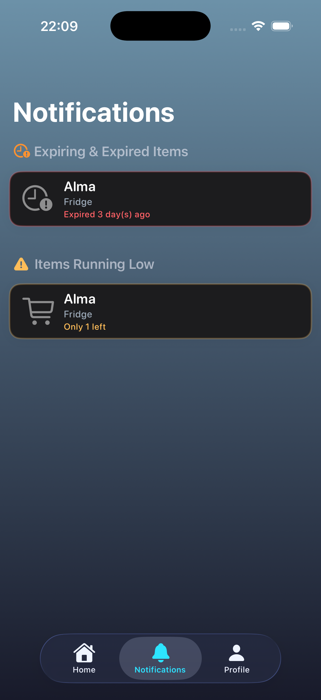 | 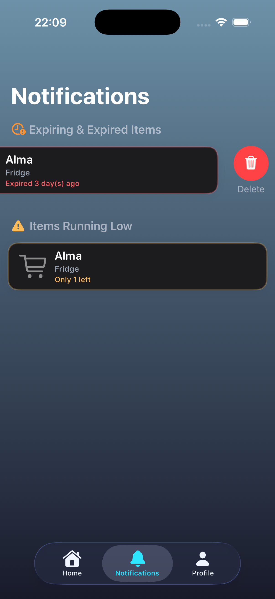 |

**Kevés készlet / Running Low**

| Lista | Swipe műveletek | Megerősítés |
|-------|-----------------|-------------|
| 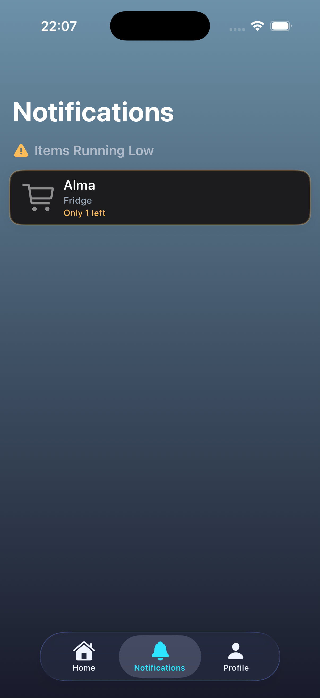 | 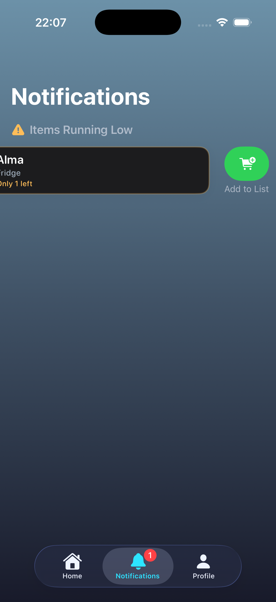 | 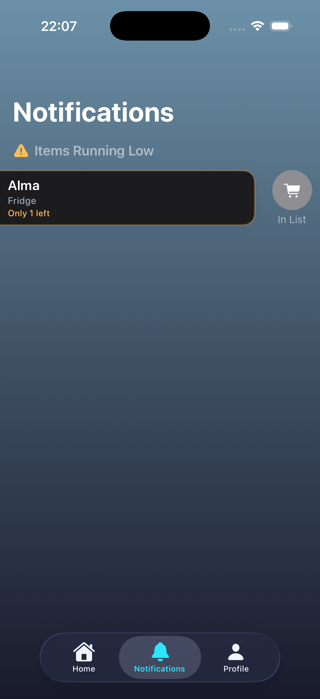 |

**Tároló meghívások / Storage Invitations**

| Meghívás | Elfogadás / Elutasítás |
|----------|------------------------|
| 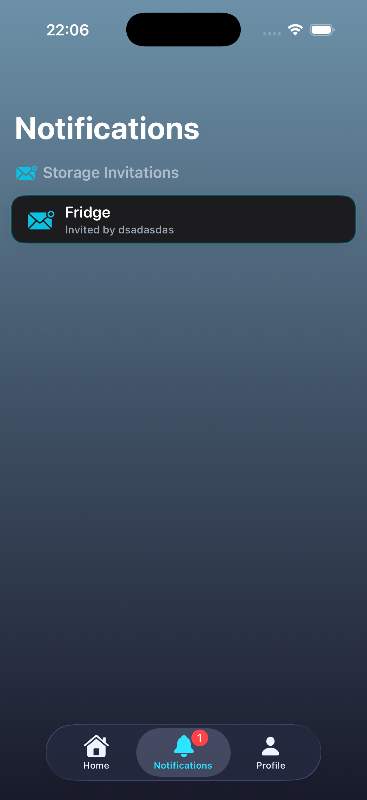 | 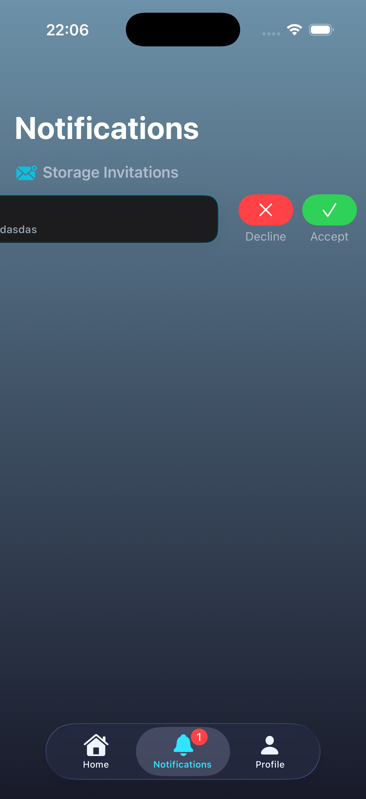 |

---

## 8. Profil / Profile

### Magyar

A profil oldalon a fiókodat és az alkalmazás beállításait kezelheted.

**Profiladatok**
- A képernyő tetején látható a profilképed, a felhasználóneved és az e-mail címed.
- Ha adminisztrátor vagy, egy arany korona ikon jelenik meg a profilképeden.
- Koppints az **Edit Profile** gombra a profil szerkesztéséhez.

**Profil szerkesztése**
- A szerkesztő panelen módosíthatod:
  - **Felhasználónév** — írd be az új nevet
  - **Profilkép** — koppints az „Upload New Picture" gombra a galéria megnyitásához, és válassz új képet
- Koppints a **Save** gombra a mentéshez.

**Beállítások**

- **Notifications (Értesítések)** — be- vagy kikapcsolhatod az értesítéseket
- **Display (Megjelenítés)** — sötét módot (Dark Mode) kapcsolhatsz be vagy ki
- **About (Névjegy)** — itt látható az alkalmazás neve és verziószáma

**Kilépés**
- Koppints a **Sign Out** gombra a fiókodból való kilépéshez.
- A gomb piros színű, nehogy véletlenül megnyomd.

---

### English

The Profile page lets you manage your account and app settings.

**Profile Info**
- Your profile picture, username, and email address are shown at the top.
- If you are an admin, a gold crown icon appears on your profile picture.
- Tap **Edit Profile** to edit your account.

**Editing Your Profile**
- In the edit sheet you can change:
  - **Username** — type your new username
  - **Profile Picture** — tap "Upload New Picture" to open your photo library and choose a new image
- Tap **Save** to apply changes.

**Settings**

- **Notifications** — toggle push notifications on or off
- **Display** — toggle Dark Mode on or off
- **About** — shows the app name and version number

**Signing Out**
- Tap the **Sign Out** button to log out of your account.
- The button is red to prevent accidental taps.

---

### Képernyőképek / Screenshots

| Profil oldal | Profil szerkesztése | Light Mode |
|--------------|---------------------|------------|
| 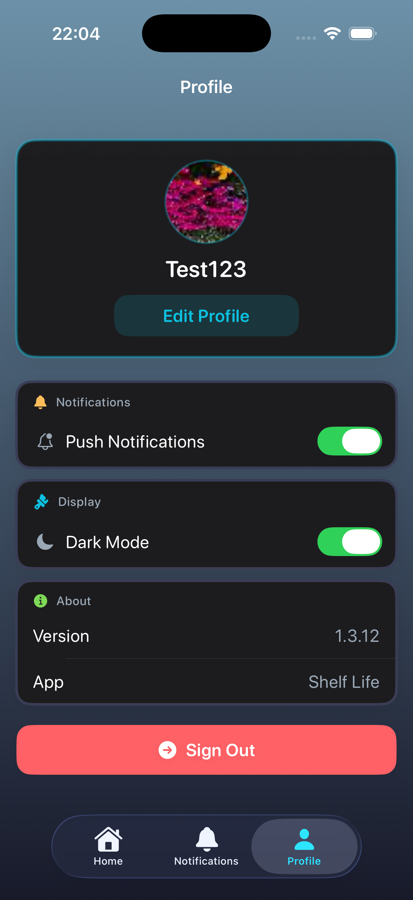 | 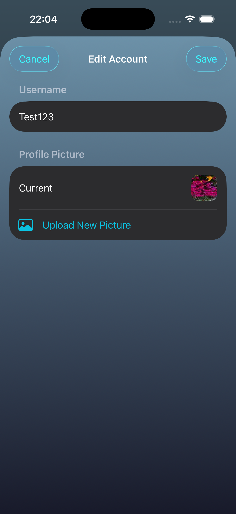 | 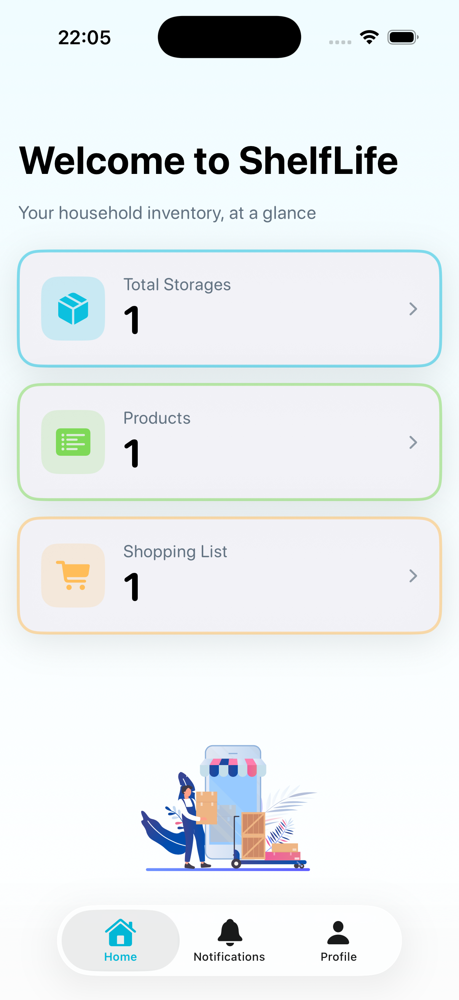 |

---

*Shelf Life v1.3.12 — Felhasználói Útmutató / User Guide*
